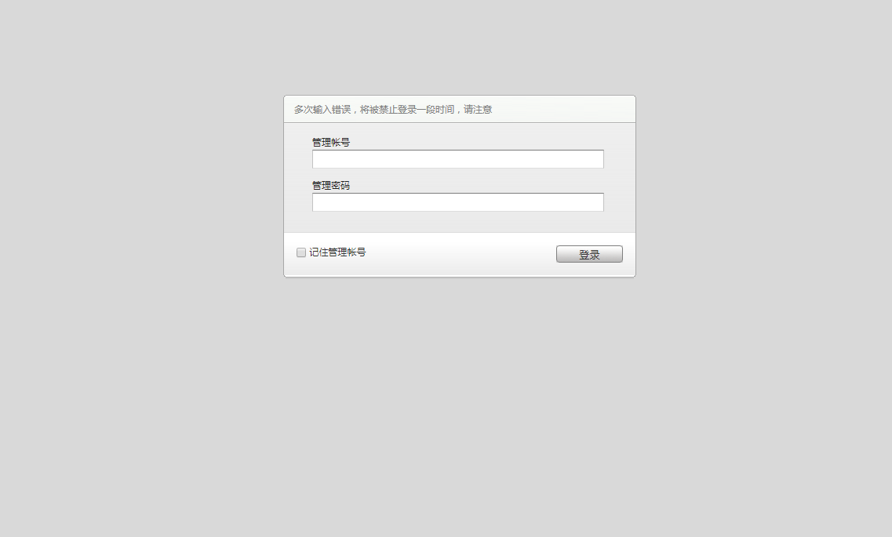
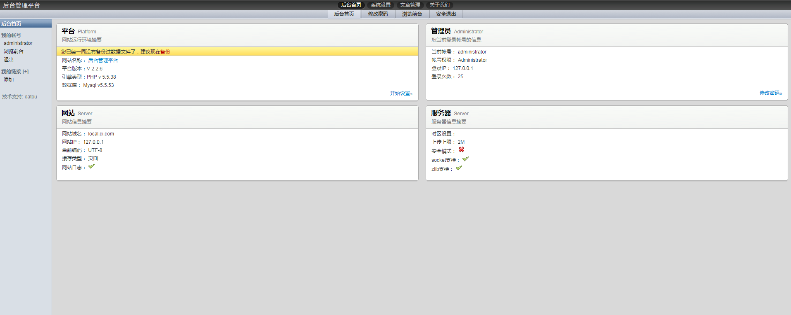
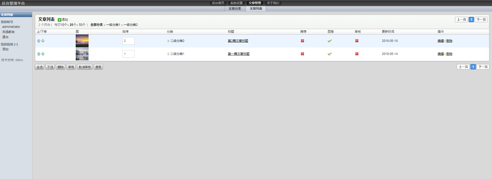

# ci
ci一个基于codeigniter2.2 框架的后台管理系统，包括登录，角色，菜单权限等。
codeigniter2.2.6

# Todo List
- [X] 用户登录
- [X] 修改管理员密码
- [X] 用户管理
- [x] 菜单管理
- [x] 权限管理
- [x] 用户角色管理
- [x] 菜单权限管理
- [x] 数据库备份
- [x] 文章管理
- [x] 单页管理

目录结构

<pre>
ci  WEB部署目录
├─api                      接口项目
│  ├─cache                 缓存目录
│  ├─config                应用配置目录
│  │  ├─autoload.php       默认访问配置文件
│  │  ├─config.php         核心配置文件
│  │  └─database.php       数据库配置
│  ├─controller            控制器目录
|  |  └───v1
│  │      ├─auth.php       登录接口
│  │      ├─article.php    文章CRUD接口
│  │      └─welcome.php    接口例程
│  ├─errors                错误页面
│  ├─helpers               助手方法文件目录
│  ├─language              语言文件目录
│  ├─libraries             扩展库目录
│  ├─logs                  日志目录
│  ├─models                模型文件目录
│  │  ├─article_model.php  文章模型文件
│  │  └─users_model.php    用户模型文件
│  └─view                  视图文件目录 
├─application              前台项目
│  ├─cache                 缓存目录
│  ├─config                应用配置目录
│  │  ├─autoload.php       默认访问配置文件
│  │  ├─config.php         核心配置文件
│  │  └─database.php       数据库配置
│  ├─controller            控制器目录
│  ├─errors                错误页面
│  ├─helpers               助手方法文件目录
│  ├─language              语言文件目录
│  ├─libraries             扩展库目录
│  ├─logs                  日志目录
│  ├─models                模型文件目录
│  └─view                  视图文件目录        
├─backend                  ci扩展项目目录
│  ├─application           后台项目
│  │  ├─cache              缓存目录
│  │  ├─config             应用配置目录
│  │  │  ├─autoload.php    默认访问配置文件
│  │  │  ├─config.php      核心配置文件
│  │  │  └─database.php    数据库配置
│  │  ├─controller         控制器目录
│  │  ├─errors             错误页面
│  │  ├─helpers            助手方法文件目录
│  │  ├─language           语言文件目录
│  │  ├─libraries          扩展库目录
│  │  ├─logs               日志目录
│  │  ├─models             模型文件目录
│  │  └─view               视图文件目录
│  ├─backup                数据库备份文件目录
│  ├─css                   样式文件目录
│  ├─fancybox              图片插件目录
│  ├─js                    js文件目录
│  ├─kindeditor            文本编辑器目录
│  ├─upload                上传图片目录
│  └─index.php             后台的入口文件
│
├─system                   codeigniter框架系统目录
│  ├─lang                  语言文件目录
│  ├─library               框架类库目录
│  │
│  ├─core                  codeigniter框架核心目录
│  ├─database              codeigniter框架数据库处理目录
│  ├─fonts                 字体目录
│  ├─helper                codeigniter框架助手方法文件目录
│  ├─language              语言文件目录
│  └─libraries             扩展库目录
│
├─LICENSE.txt              授权说明文件
├─README.md                README 文件
└─index.php                前台的入口文件
</pre>

测试地址 http://local.ci.com/backend/index.php

用户名：administrator

密　码：123456

<h2>作者长期从事PHP开发</h2>
<pre>
<ul>
<li>昵称:datou</li>
<li>qq:2323178881</li>
<li>Tel:18329123270</li>
<li>微信:datou-leo</li>
<li>ci使用开发群:646864389</li>
</ul>
<pre>

# 界面预览

1.登录
--

2.首页

2.文章列表

